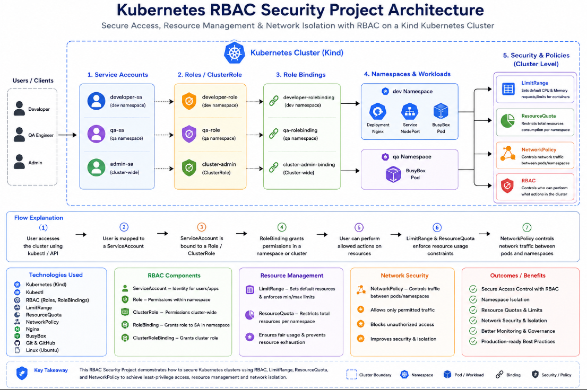

# 🔐 Kubernetes RBAC Security Project

<p align="center">


</p>

<p align="center">

A Production-Inspired Kubernetes Security Project demonstrating **RBAC, ServiceAccounts, Roles, RoleBindings, ClusterRoles, ResourceQuota, LimitRange and NetworkPolicy** on a **Kind Kubernetes Cluster**.

</p>

---

# 📑 Table of Contents

- 📖 Project Overview
- 🎯 Objectives
- 🛠 Tech Stack
- 🏗 Architecture
- 🔄 Workflow
- 📂 Project Structure
- 🚀 Getting Started
- 📦 Project Deployment
- 🔎 Verification
- 🔐 RBAC Testing
- 📊 LimitRange Testing
- 📈 ResourceQuota Testing
- 🌐 NetworkPolicy
- 📷 Project Screenshots
- ✨ Features
- 📚 What I Learned
- 💡 Interview Questions
- 🚀 Future Improvements
- 👨‍💻 Author

---

# 📖 Project Overview

This project demonstrates how **Kubernetes Role-Based Access Control (RBAC)** secures workloads using namespace-based authorization and resource management.

The project follows Kubernetes security best practices by implementing:

- Multi-namespace architecture
- Kubernetes RBAC
- ServiceAccounts
- Roles
- RoleBindings
- ClusterRoles
- ClusterRoleBindings
- ResourceQuota
- LimitRange
- NetworkPolicy
- Secure Application Deployment
- RBAC Permission Testing

The project is built on a **Kind Kubernetes Cluster** and simulates a real-world production environment where different teams have different levels of access.

---

## 🎯 Objectives

The main objectives of this project are:

- Deploy applications on Kubernetes
- Configure Role-Based Access Control (RBAC)
- Create multiple namespaces
- Create ServiceAccounts for different teams
- Configure Roles and ClusterRoles
- Configure RoleBindings and ClusterRoleBindings
- Restrict access using RBAC
- Configure ResourceQuota
- Configure LimitRange
- Configure NetworkPolicy
- Test Kubernetes Security
- Understand Production Security Best Practices

---

# 🛠 Tech Stack

| Technology | Purpose |
|------------|----------|
| Ubuntu | Operating System |
| Docker | Container Runtime |
| Kind | Kubernetes Cluster |
| Kubernetes | Container Orchestration |
| Kubectl | Kubernetes CLI |
| RBAC | Access Control |
| ServiceAccounts | Identity Management |
| ResourceQuota | Namespace Resource Limits |
| LimitRange | Default CPU & Memory |
| NetworkPolicy | Network Security |
| Nginx | Demo Application |
| BusyBox | Testing Pod |
| Git | Version Control |
| GitHub | Project Hosting |

---
# 🏗 Architecture

The following architecture illustrates how **RBAC**, **ServiceAccounts**, **Roles**, **RoleBindings**, **Namespaces**, and **Security Policies** work together to secure applications inside a Kubernetes cluster.

<p align="center">



</p>

---

## 🏛 Architecture Components

| Component | Description |
|-----------|-------------|
| **Kind Cluster** | Local Kubernetes Cluster used for development |
| **Namespaces** | Separate Dev and QA environments |
| **ServiceAccounts** | Identity for applications |
| **Roles** | Define namespace permissions |
| **RoleBindings** | Assign Roles to ServiceAccounts |
| **ClusterRole** | Cluster-wide permissions |
| **ClusterRoleBinding** | Assign ClusterRole to ServiceAccounts |
| **Deployment** | Deploys the Nginx application |
| **NodePort Service** | Exposes the application |
| **BusyBox Pods** | Used for testing RBAC & Networking |
| **LimitRange** | Automatically assigns default CPU & Memory |
| **ResourceQuota** | Restricts namespace resource usage |
| **NetworkPolicy** | Controls communication between namespaces |

---

# 🔄 Project Workflow

```text
                    User
                      │
                      ▼
                kubectl / API
                      │
                      ▼
          Kubernetes Cluster (Kind)
                      │
     ┌────────────────┴────────────────┐
     │                                 │
     ▼                                 ▼
Dev Namespace                    QA Namespace
     │                                 │
     ▼                                 ▼
developer-sa                     qa-sa / viewer-sa
     │                                 │
     ▼                                 ▼
Developer Role                  QA Role / Viewer Role
     │                                 │
     ▼                                 ▼
RoleBinding                    RoleBinding
     │                                 │
     ▼                                 ▼
Nginx Deployment              BusyBox Pod
     │
     ▼
NodePort Service
     │
     ▼
Application Access
     │
     ▼
LimitRange
     │
     ▼
ResourceQuota
     │
     ▼
NetworkPolicy
     │
     ▼
Security Enforcement
```

---

## 📌 Workflow Explanation

### Step 1

The Kubernetes cluster is created using **Kind**.

↓

### Step 2

Two namespaces are created:

- dev
- qa

↓

### Step 3

Different ServiceAccounts are created for different teams.

- developer-sa
- qa-sa
- viewer-sa
- admin-sa

↓

### Step 4

Roles and ClusterRoles define permissions.

↓

### Step 5

RoleBindings and ClusterRoleBindings assign permissions to ServiceAccounts.

↓

### Step 6

LimitRange automatically assigns default CPU and Memory requests/limits.

↓

### Step 7

ResourceQuota limits namespace resource usage.

↓

### Step 8

The Nginx application is deployed.

↓

### Step 9

BusyBox Pods are deployed for testing.

↓

### Step 10

A NodePort Service exposes the application.

↓

### Step 11

NetworkPolicy secures communication between namespaces.

↓

### Step 12

RBAC, ResourceQuota and LimitRange are tested.

---

# 📂 Project Structure

```text
RBAC-Project/
│
├── README.md
│
├── namespaces/
│   ├── dev.yaml
│   └── qa.yaml
│
├── serviceaccounts/
│   ├── developer-sa.yaml
│   ├── qa-sa.yaml
│   ├── viewer-sa.yaml
│   └── admin-sa.yaml
│
├── roles/
│   ├── developer-role.yaml
│   ├── qa-role.yaml
│   ├── viewer-role.yaml
│   └── admin-clusterrole.yaml
│
├── bindings/
│   ├── developer-binding.yaml
│   ├── qa-binding.yaml
│   ├── viewer-binding.yaml
│   └── admin-binding.yaml
│
├── limitrange/
│   ├── dev-limitrange.yaml
│   └── qa-limitrange.yaml
│
├── resourcequota/
│   ├── dev-resourcequota.yaml
│   └── qa-resourcequota.yaml
│
├── networkpolicy/
│   ├── default-deny-dev.yaml
│   ├── default-deny-qa.yaml
│   ├── allow-dev-internal.yaml
│   └── allow-qa-internal.yaml
│
├── manifests/
│   ├── deployment.yaml
│   ├── service.yaml
│   ├── busybox-dev.yaml
│   ├── busybox-qa.yaml
│   ├── limitrange-test.yaml
│   ├── limitrange-fail.yaml
│   └── test-resourcequota-pod.yaml
│
└── screenshots/
    ├── 01-namespaces.png
    ├── 02-serviceaccounts.png
    ├── 03-roles.png
    ├── ...
    └── 29-readme-preview.png
```

---

## 📌 Folder Description

| Folder | Purpose |
|---------|----------|
| **namespaces/** | Namespace configuration files |
| **serviceaccounts/** | ServiceAccount YAML files |
| **roles/** | Roles & ClusterRole definitions |
| **bindings/** | RoleBindings & ClusterRoleBindings |
| **limitrange/** | Default CPU & Memory configuration |
| **resourcequota/** | Namespace resource limits |
| **networkpolicy/** | Network isolation policies |
| **manifests/** | Deployments, Services & Test Pods |
| **screenshots/** | Project screenshots for documentation |

---
# 🚀 Getting Started

## 📋 Prerequisites

Before starting this project, make sure the following tools are installed:

| Software | Version |
|----------|----------|
| Ubuntu | 22.04+ |
| Docker | Latest |
| Kubernetes | v1.34.x |
| Kind | v0.30+ |
| Kubectl | v1.34.x |
| Git | Latest |

Verify the installation:

```bash
docker --version
kind version
kubectl version --client
git --version
```

---

# 🏗 Create Kind Cluster

Create a Kubernetes cluster.

```bash
kind create cluster --name dev-cluster
```

Verify:

```bash
kubectl cluster-info
```

Check nodes:

```bash
kubectl get nodes
```

Expected Output

```text
NAME                     STATUS
dev-cluster-control-plane Ready
dev-cluster-worker Ready
dev-cluster-worker2 Ready
dev-cluster-worker3 Ready
```

---

# 📦 Deploy the Project

Apply each resource in the correct order.

## 1️⃣ Create Namespaces

```bash
kubectl apply -f namespaces/
```

Verify

```bash
kubectl get ns
```

---

## 2️⃣ Create ServiceAccounts

```bash
kubectl apply -f serviceaccounts/
```

Verify

```bash
kubectl get sa -A
```

---

## 3️⃣ Create Roles

```bash
kubectl apply -f roles/
```

Verify

```bash
kubectl get role -A
kubectl get clusterrole admin-cluster-role
```

---

## 4️⃣ Create RoleBindings

```bash
kubectl apply -f bindings/
```

Verify

```bash
kubectl get rolebinding -A
kubectl get clusterrolebinding admin-binding
```

---

## 5️⃣ Configure LimitRange

```bash
kubectl apply -f limitrange/
```

Verify

```bash
kubectl get limitrange -A
```

---

## 6️⃣ Configure ResourceQuota

```bash
kubectl apply -f resourcequota/
```

Verify

```bash
kubectl get resourcequota -A
```

---

## 7️⃣ Deploy Application

```bash
kubectl apply -f manifests/deployment.yaml
```

Verify

```bash
kubectl get deployment -n dev
```

---

## 8️⃣ Create Service

```bash
kubectl apply -f manifests/service.yaml
```

Verify

```bash
kubectl get svc -n dev
```

---

## 9️⃣ Deploy BusyBox Pods

```bash
kubectl apply -f manifests/busybox-dev.yaml
kubectl apply -f manifests/busybox-qa.yaml
```

Verify

```bash
kubectl get pods -A
```

---

## 🔟 Configure NetworkPolicy

```bash
kubectl apply -f networkpolicy/
```

Verify

```bash
kubectl get networkpolicy -A
```

---

# 🌐 Access the Application

Since this project runs on a Kind cluster, expose the application using port forwarding.

```bash
kubectl port-forward service/nginx-service 9090:80 -n dev
```

Open your browser:

```text
http://localhost:9090
```

Expected Page

```text
Welcome to nginx!
```

---

# 🔍 Verification Commands

Verify all Kubernetes resources.

### Cluster

```bash
kubectl cluster-info
```

### Nodes

```bash
kubectl get nodes
```

### Namespaces

```bash
kubectl get ns
```

### ServiceAccounts

```bash
kubectl get sa -A
```

### Roles

```bash
kubectl get role -A
```

### ClusterRoles

```bash
kubectl get clusterrole admin-cluster-role
```

### RoleBindings

```bash
kubectl get rolebinding -A
```

### ClusterRoleBindings

```bash
kubectl get clusterrolebinding
```

### Deployments

```bash
kubectl get deployment -A
```

### Services

```bash
kubectl get svc -A
```

### Pods

```bash
kubectl get pods -A
```

### ResourceQuota

```bash
kubectl get resourcequota -A
```

### LimitRange

```bash
kubectl get limitrange -A
```

### NetworkPolicy

```bash
kubectl get networkpolicy -A
```

---

# 🛠 Troubleshooting

## Pods Not Starting

```bash
kubectl describe pod <pod-name> -n <namespace>
```

```bash
kubectl logs <pod-name> -n <namespace>
```

---

## Deployment Issues

```bash
kubectl describe deployment nginx-deployment -n dev
```

---

## ResourceQuota Errors

```bash
kubectl describe resourcequota dev-resourcequota -n dev
```

---

## LimitRange Errors

```bash
kubectl describe limitrange dev-limitrange -n dev
```

---

## RBAC Issues

```bash
kubectl auth can-i --list \
--as=system:serviceaccount:dev:developer-sa \
-n dev
```

---

## NetworkPolicy

> **Note:** Kind uses **kindnet** by default, which **does not enforce NetworkPolicy**.  
> For production-style testing, use **Calico** or **Cilium** as the CNI plugin.

---

# 💡 Best Practices

- Follow the Principle of Least Privilege (PoLP).
- Use separate namespaces for different teams.
- Assign permissions through Roles and RoleBindings.
- Apply ResourceQuota to avoid resource exhaustion.
- Use LimitRange to enforce default CPU and Memory requests.
- Use NetworkPolicy to restrict pod-to-pod communication.
- Test permissions using `kubectl auth can-i`.
- Store Kubernetes manifests in version control.
- Keep secrets out of Git repositories.

# 🔐 RBAC Testing

The following commands were used to verify Role-Based Access Control (RBAC) permissions for different ServiceAccounts.

## 👨‍💻 Developer Permissions

```bash
kubectl auth can-i create pods \
--as=system:serviceaccount:dev:developer-sa \
-n dev

kubectl auth can-i delete deployments \
--as=system:serviceaccount:dev:developer-sa \
-n dev

kubectl auth can-i create configmaps \
--as=system:serviceaccount:dev:developer-sa \
-n dev

kubectl auth can-i create pods \
--as=system:serviceaccount:dev:developer-sa \
-n qa
```

### Expected Result

| Action | Result |
|---------|--------|
| Create Pods in dev | ✅ Yes |
| Delete Deployments | ✅ Yes |
| Create ConfigMaps | ✅ Yes |
| Create Pods in qa | ❌ No |

---

## 🧪 QA Permissions

```bash
kubectl auth can-i get pods \
--as=system:serviceaccount:qa:qa-sa \
-n qa

kubectl auth can-i list pods \
--as=system:serviceaccount:qa:qa-sa \
-n qa

kubectl auth can-i create pods \
--as=system:serviceaccount:qa:qa-sa \
-n qa
```

| Action | Result |
|---------|--------|
| View Pods | ✅ Yes |
| List Pods | ✅ Yes |
| Create Pods | ❌ No |

---

## 👀 Viewer Permissions

```bash
kubectl auth can-i get pods \
--as=system:serviceaccount:qa:viewer-sa \
-n qa

kubectl auth can-i delete pods \
--as=system:serviceaccount:qa:viewer-sa \
-n qa
```

| Action | Result |
|---------|--------|
| View Pods | ✅ Yes |
| Delete Pods | ❌ No |

---

## 👑 Administrator Permissions

```bash
kubectl auth can-i create namespaces \
--as=system:serviceaccount:default:admin-sa

kubectl auth can-i delete nodes \
--as=system:serviceaccount:default:admin-sa

kubectl auth can-i create clusterroles \
--as=system:serviceaccount:default:admin-sa
```

Expected:

| Action | Result |
|---------|--------|
| Create Namespace | ✅ Yes |
| Delete Nodes | ✅ Yes |
| Create ClusterRoles | ✅ Yes |

---

# 📊 LimitRange Testing

A Pod was created **without defining CPU or Memory resources**.

Kubernetes automatically applied the default values defined by the LimitRange.

Verification:

```bash
kubectl describe pod limitrange-test -n dev
```

Expected:

```text
Requests

CPU : 100m

Memory : 128Mi

Limits

CPU : 200m

Memory : 256Mi
```

### Maximum Resource Test

A Pod requesting resources beyond the configured LimitRange was created.

Expected:

```text
Error from server (Forbidden)

maximum cpu usage per Container is 500m

maximum memory usage per Container is 512Mi
```

---

# 📈 ResourceQuota Testing

ResourceQuota was configured to restrict namespace resource consumption.

Verification:

```bash
kubectl describe resourcequota dev-resourcequota -n dev
```

Expected:

```text
Pods

Requests CPU

Limits CPU

Requests Memory

Limits Memory
```

### Quota Enforcement

When the namespace reached the maximum allowed Pods:

```bash
kubectl run pod-test --image=nginx -n dev
```

Expected:

```text
Error from server (Forbidden)

exceeded quota:
dev-resourcequota
```

This confirms ResourceQuota enforcement.

---

# 🌐 NetworkPolicy

NetworkPolicy resources were created to isolate workloads between namespaces.

### Policies

- Default Deny (dev)
- Default Deny (qa)
- Allow Internal Traffic (dev)
- Allow Internal Traffic (qa)

Verification:

```bash
kubectl get networkpolicy -A
```

> **Note**
>
> This project uses the default **Kind** networking plugin (**kindnet**).
>
> `kindnet` allows NetworkPolicy resources to be created but **does not enforce them**.
>
> To demonstrate actual network isolation, replace the default CNI with **Calico** or **Cilium**.

---

# 📷 Project Screenshots

| Screenshot | Description |
|------------|-------------|
| 01 | Namespaces |
| 02 | ServiceAccounts |
| 03 | Roles |
| 04 | ClusterRole |
| 05 | RoleBindings |
| 06 | ClusterRoleBinding |
| 07 | LimitRange |
| 08 | LimitRange Description |
| 09 | ResourceQuota |
| 10 | ResourceQuota Description |
| 11 | ResourceQuota Enforcement |
| 12 | Running Workloads |
| 13 | BusyBox Pod |
| 14 | Resource Usage |
| 15 | NodePort Service |
| 16 | Nginx Application |
| 17 | Kubernetes Resources |
| 18 | NetworkPolicy |
| 19 | BusyBox → Nginx Communication |
| 20 | NetworkPolicy Testing |
| 21 | Developer RBAC |
| 22 | QA RBAC |
| 23 | Viewer RBAC |
| 24 | Admin RBAC |
| 25 | LimitRange Testing |
| 26 | LimitRange Maximum Validation |
| 27 | ResourceQuota Usage |
| 28 | ResourceQuota Enforcement |
| 29 | README Preview |

---

# ✨ Features

- Multi-Namespace Kubernetes Architecture
- Role-Based Access Control (RBAC)
- ServiceAccounts
- Roles & RoleBindings
- ClusterRoles & ClusterRoleBindings
- Namespace Isolation
- ResourceQuota
- LimitRange
- NetworkPolicy
- Nginx Deployment
- BusyBox Testing Pods
- NodePort Service
- RBAC Testing
- ResourceQuota Testing
- LimitRange Testing
- Production-Inspired Security Configuration

---

# 📚 Key Learnings

Through this project, I learned:

- Kubernetes RBAC implementation
- Namespace-based access control
- ServiceAccount management
- Role & ClusterRole configuration
- RoleBinding & ClusterRoleBinding
- ResourceQuota implementation
- LimitRange configuration
- NetworkPolicy basics
- Kubernetes security best practices
- Troubleshooting Kubernetes resources
- Managing Kubernetes using YAML manifests

---

# 🚀 Future Improvements

- Replace Kindnet with Calico for NetworkPolicy enforcement
- Deploy the project on Amazon EKS
- Install Prometheus & Grafana
- Configure Jenkins CI/CD Pipeline
- Use Helm Charts
- Implement GitOps using Argo CD
- Add Kyverno or OPA Gatekeeper security policies
- Integrate Falco for runtime security monitoring

---

# 👨‍💻 Author

## Akshit Barthwal

**DevOps | AWS | Kubernetes | Docker | Jenkins | Linux**

If you found this project helpful, please consider giving it a ⭐ on GitHub.

---

