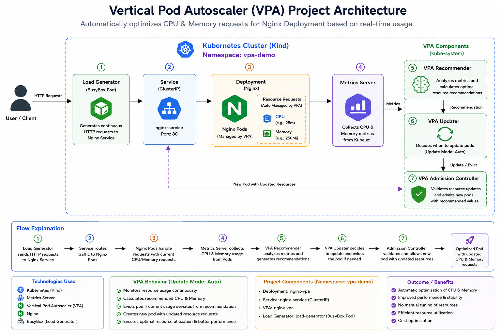

# 🚀 Kubernetes Vertical Pod Autoscaler (VPA) Project

Automatically optimize **CPU** and **Memory** requests for Kubernetes applications using the **Vertical Pod Autoscaler (VPA)** on a **Kind Kubernetes Cluster**.

---

## 📖 Project Overview

This project demonstrates how **Vertical Pod Autoscaler (VPA)** automatically adjusts container resource requests based on actual CPU and Memory usage.

An **Nginx** application is deployed on a **Kind Kubernetes Cluster**, while the **Metrics Server** collects resource metrics. A **BusyBox Load Generator** generates continuous traffic, allowing VPA to analyze resource consumption and recommend or apply optimized CPU and Memory requests.

---

## 🎯 Objectives

- Deploy an application on Kubernetes
- Install Metrics Server
- Configure Vertical Pod Autoscaler (VPA)
- Generate application workload
- Monitor CPU & Memory usage
- Automatically optimize Pod resources

---

## 🛠️ Tech Stack

| Technology | Purpose |
|------------|---------|
| Ubuntu | Operating System |
| Docker | Container Runtime |
| Kind | Kubernetes Cluster |
| Kubernetes | Container Orchestration |
| Metrics Server | Resource Monitoring |
| VPA | Resource Optimization |
| Nginx | Sample Application |
| BusyBox | Load Generator |
| Git & GitHub | Version Control |

---

## 🏗️ Architecture



---

## 🔄 Workflow

```text
User
   │
   ▼
BusyBox Load Generator
   │
   ▼
Kubernetes Service
   │
   ▼
Nginx Deployment
   │
   ▼
Metrics Server
   │
   ▼
VPA Recommender
   │
   ▼
VPA Updater
   │
   ▼
Optimized Pod
```

---

## 📁 Project Structure

```text
VPA-Project/
│
├── deployment.yaml
├── service.yaml
├── vpa.yaml
├── load-generator.yaml
├── architecture.png
├── README.md
└── screenshots/
```

---

## 🚀 Getting Started

### 1. Create Kind Cluster

```bash
kind create cluster --name dev-cluster
```

### 2. Install Metrics Server

```bash
kubectl apply -f https://github.com/kubernetes-sigs/metrics-server/releases/latest/download/components.yaml
```

### 3. Install VPA

```bash
git clone https://github.com/kubernetes/autoscaler.git

cd autoscaler/vertical-pod-autoscaler

./hack/vpa-up.sh
```

### 4. Deploy the Project

```bash
kubectl create namespace vpa-demo

kubectl apply -f deployment.yaml
kubectl apply -f service.yaml
kubectl apply -f vpa.yaml
kubectl apply -f load-generator.yaml
```

---

## 🔍 Verification

```bash
kubectl get pods -n vpa-demo
kubectl get svc -n vpa-demo
kubectl get vpa -n vpa-demo
kubectl top pods -n vpa-demo
kubectl describe vpa nginx-vpa -n vpa-demo
```

---

## 📸 Project Screenshots

- ✅ Kind Cluster
- ✅ Metrics Server
- ✅ Nginx Deployment
- ✅ Service
- ✅ VPA Installation
- ✅ VPA Recommendation
- ✅ Load Generator
- ✅ Pod Resource Usage
- ✅ Updated Resource Requests

---

## ✨ Features

- Deploy Nginx on Kubernetes
- Configure Metrics Server
- Install Vertical Pod Autoscaler
- Generate application traffic
- Monitor resource usage
- Automatically optimize CPU & Memory requests
- Observe VPA recommendations

---

## 📚 What I Learned

- Kubernetes Deployments & Services
- Resource Requests & Limits
- Metrics Server Configuration
- Vertical Pod Autoscaler (VPA)
- Pod Resource Optimization
- Kubernetes Monitoring
- Git & GitHub

---

## 🚀 Future Improvements

- Deploy on Amazon EKS
- Package with Helm
- Integrate Prometheus & Grafana
- Build a Jenkins CI/CD Pipeline
- Implement GitOps with ArgoCD

---

## 👨‍💻 Author

**Akshit Barthwal**

---

⭐ **If you found this project useful, consider giving it a Star!**
